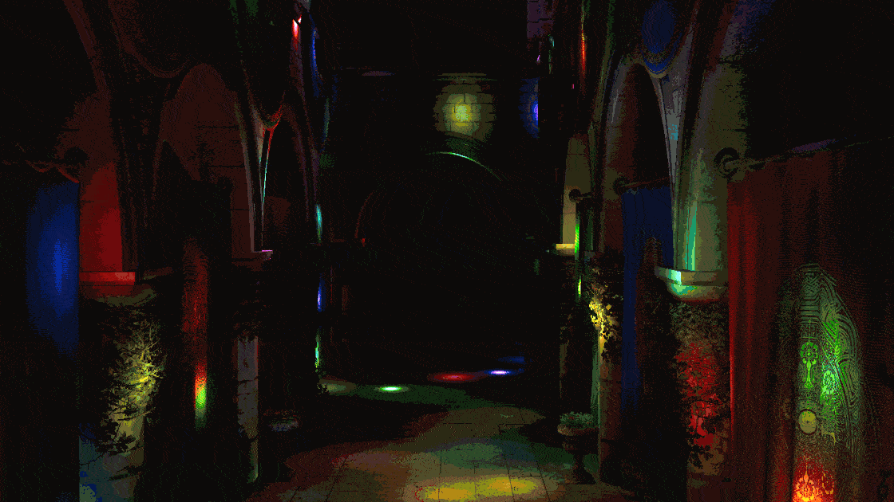
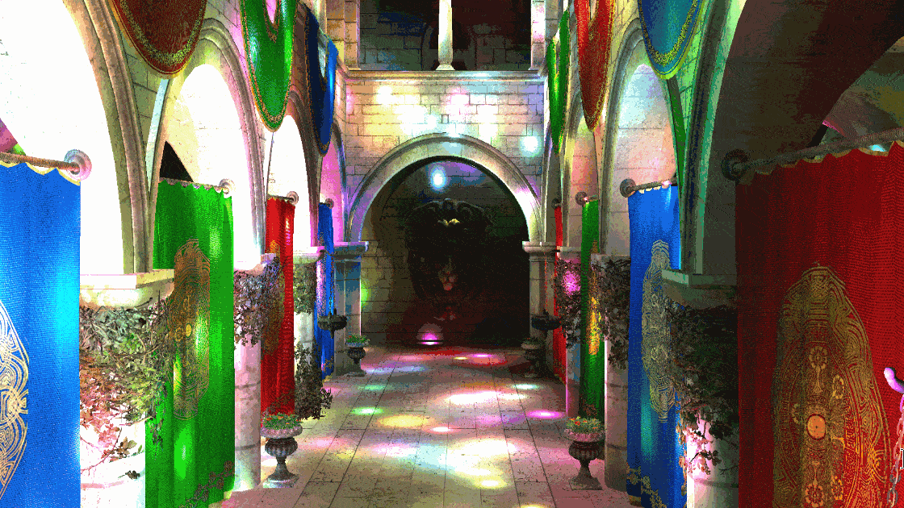

# WebGPU Forward+ and Clustered Deferred Shading
Forward+ and Clustered Deferred shading in WebGPU.

**Author:** Lu M.
- [LinkedIn](https://www.linkedin.com/in/lu-m-673425323/)
- [Personal site](lu-m-dev.github.io)

**Tested System:**
 - Windows 11 Home
 - AMD Ryzen 7 5800HS @ 3.20GHz, 16GB RAM
 - NVIDIA GeForce RTX 3060 Laptop GPU 6GB (Compute Capability 8.6)
 - Brave 1.83.118 (Official Build) (64-bit), Chromium: 141.0.7390.108

---

## Abstract

This project implements and compares three real-time lighting approaches in WebGPU:
- a naive forward renderer,
- Forward+, and
- Clustered Deferred.

It renders the Sponza scene with thousands of animated point lights and measures how each approach scales.

Forward+ and Clustered Deferred first partition the camera frustum into a 3D grid of clusters and assign lights to clusters using a compute pass. The main difference is where shading occurs: Forward+ computes lighting per-fragment during geometry pass using clustered lists; Clustered Deferred defers lighting to a fullscreen pass using a G-buffer.

**Conclusion:** The naive approach quickly becomes the bottleneck as it loops over all lights per fragment. Forward+ holds 60 FPS up to around 700–1000 lights but begins to fall as complexity increases due to growing per-fragment work and bandwidth. Clustered Deferred maintains high performance even into thousands of lights by separating visibility (G-buffer) from lighting and limiting light evaluations to the clustered lists in a single fullscreen pass.

---

## Visual comparison

### 1000 lights

<table style="table-layout: fixed; width: 100%;">
	<thead>
		<tr>
			<th style="width: 33.33%; text-align: center;">Naive</th>
			<th style="width: 33.33%; text-align: center;">Forward+</th>
			<th style="width: 33.33%; text-align: center;">Clustered Deferred</th>
		</tr>
	</thead>
	<tbody>
		<tr>
			<td></td>
			<td></td>
			<td></td>
		</tr>
	</tbody>
	</table>

### 5000 lights

<table style="table-layout: fixed; width: 100%;">
	<thead>
		<tr>
			<th style="width: 50%; text-align: center;">Naive</th>
			<th style="width: 50%; text-align: center;">Forward+</th>
			<th style="width: 50%; text-align: center;">Clustered Deferred</th>
		</tr>
	</thead>
	<tbody>
		<tr>
			<td></td>
			<td></td>
			<td></td>
		</tr>
	</tbody>
	</table>

---

## Build instructions

1) Download [Node.js](https://nodejs.org/en/download).

2) Clone repository

	```cmd
	git clone https://github.com/lu-m-dev/WebGPU-forward-and-clustered-deferred-shading.git
	```

3) Install dependencies
	```cmd
	cd WebGPU-forward-and-clustered-deferred-shading
	npm install
	```

4) Launch dev server

	```cmd
	npm run dev
	```
	Optional build to static `dist/`

	```cmd
	npm run build
	```

---

## Shading methods

### Naive forward

- The fragment shader loops over every light for every pixel: see `naive.fs.wgsl` where it accumulates `calculateLightContrib` over `lightSet.numLights`.
- CPU-side, `NaiveRenderer` sets a single render pipeline and binds camera uniforms and a read-only storage buffer containing all lights.

### Forward+

- Compute clustering: The frustum is partitioned into a 3D grid (constants in `src/shaders/shaders.ts`: `clusterWidth`, `clusterHeight`, `clusterDepth`). The compute shader `clustering.cs.wgsl` computes per-cluster AABBs in view space and assigns light indices with simple sphere–AABB tests. Results go to a `ClusterSet` SSBO.
- Shading: In `forward_plus.fs.wgsl`, each fragment determines its cluster (using screen xy and logarithmic z slice), looks up that cluster’s light list, and accumulates only those lights. The vertex stage reuses the naive vertex shader.

### Clustered Deferred

- Pass 1 (G-buffer): Render geometry to multiple targets storing world position, normal, and albedo only. No lighting here. See `clustered_deferred.fs.wgsl` for outputs.
- Pass 2 (Fullscreen lighting): A fullscreen triangle samples the G-buffer. The fragment shader `clustered_deferred_fullscreen.fs.wgsl` computes the fragment’s cluster, fetches the precomputed light list, and accumulates lighting using surface data from the G-buffer.
- Same clustering compute pass as Forward+ re-used from `lights.doLightClustering`.
- Benefits: Decouples material/visibility from lighting, improving cache behavior and allowing complex lighting with only a fullscreen pass after geometry. Bandwidth is the main cost (writing/reading G-buffer), but per-fragment light loops are limited by clusters rather than total lights.

---

## Performance analysis


- Naive: 41 FPS at 100 lights drops to ~1–4 FPS by 1000–2000 lights. This matches O(L) per-fragment cost: every pixel loops over all lights.
- Forward+: Holds 60 FPS up to ~700 lights, 49 FPS at 1000, and declines to ~12 FPS at 5000 lights as clusters become populated and per-fragment light lists grow. Overhead includes per-fragment light loops and material sampling during geometry.
- Clustered Deferred: Stays at or near 60 FPS up to ~2000 lights, still ~45 FPS at 5000. It scales best because lighting is done in a single fullscreen pass over visible pixels using compact per-cluster light lists; geometry pass is light-weight (no lighting), and shading work is proportional to lights-per-cluster rather than total lights.

Why clustered deferred scales well:
- Culls lights spatially in 3D (xy and logarithmic z) before shading, so each pixel evaluates only nearby lights.
- Separates visibility/material writes (first pass) from lighting (second pass), improving coherence and reducing repeated material fetches compared to forward approaches.
- Fullscreen pass avoids overdraw costs of computing lighting for hidden fragments.

---

## Credits
- [CIS 5650 Materials](https://github.com/CIS5650-Fall-2025/Project4-WebGPU-Forward-Plus-and-Clustered-Deferred)
- [Vite](https://vitejs.dev/)
- [loaders.gl](https://loaders.gl/)
- [dat.GUI](https://github.com/dataarts/dat.gui)
- [stats.js](https://github.com/mrdoob/stats.js)
- [wgpu-matrix](https://github.com/greggman/wgpu-matrix)
